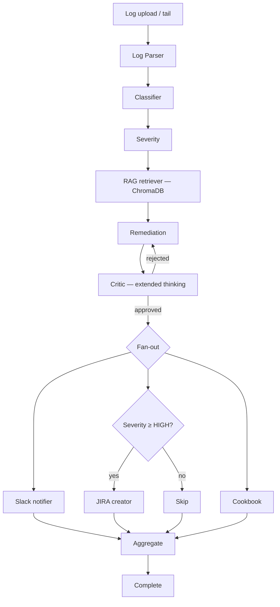

# Multi-Agent DevOps Incident Analysis Suite

An AI-powered incident response pipeline that ingests raw operational logs, classifies failures, retrieves similar past incidents from a vector store, recommends remediation, runs that remediation through a self-critique safety check, and dispatches actionable artifacts to Slack and JIRA — coordinated by a **LangGraph** orchestrator running specialist Claude agents in series and in parallel.

Three ways to use it:
- **Live dashboard** — FastAPI + SSE backend, animated DAG, three-panel layout, log-tail mode
- **MCP server** — same pipeline exposed as tools to any MCP client (Claude Desktop, `claude` CLI, Cursor)
- **Python API** — invoke the graph directly for tests or batch jobs

---

## What it does

1. User uploads or tails an ops log file (Kubernetes events, syslog, JSON application logs)
2. **Parser** chunks the raw text into typed `LogEvent`s
3. **Classifier agent** groups events into discrete incidents
4. **Severity agent** scores each incident `LOW / MEDIUM / HIGH / CRITICAL` against an explicit rubric
5. **RAG retriever** searches a Chroma vector store for similar past incidents
6. **Remediation agent** generates root-cause analysis and ordered fix steps, grounded on the RAG matches
7. **Critic agent** reviews the remediation with extended thinking; can reject and route the graph back to remediation for a revision
8. In parallel, three downstream agents fan out:
   - **Slack notifier** posts a formatted incident summary
   - **JIRA agent** creates a real ticket — but **only** for `HIGH` / `CRITICAL` incidents (severity gate as a guardrail)
   - **Cookbook synthesizer** distills the run into a reusable runbook entry
9. Dashboard streams every step live with an animated graph, hover tooltips, and a per-run cost meter

---

## Architecture



The orchestrator is a typed `StateGraph` with conditional routing (severity gate, critic loop) and parallel fan-out. Plain agent chains break down once you have those — LangGraph handles all three natively, and the typed `IncidentState` is what makes it a real multi-agent system instead of a pipeline.

---

## Concepts demonstrated

Each is referenced in the code with a `# CONCEPT:` comment so it's traceable.

| # | Concept | Where |
|---|---------|-------|
| 1 | **Multi-agent orchestration** with LangGraph `StateGraph` | [src/graph.py](src/graph.py) |
| 2 | **Supervisor / orchestrator pattern** | [src/graph.py](src/graph.py) (orchestrator owns control flow) |
| 3 | **Specialist agents** with focused system prompts | [src/agents/*.py](src/agents/) |
| 4 | **Structured output** via Pydantic schemas + Anthropic tool use | [src/state.py](src/state.py), [src/agents/classifier.py](src/agents/classifier.py) |
| 5 | **Conditional routing / dynamic edges** | [src/graph.py:40-65](src/graph.py#L40-L65) (`route_after_critic`, `should_create_ticket`) |
| 6 | **Parallel agent execution** (fan-out / fan-in) | [src/graph.py:137-150](src/graph.py#L137-L150) (Slack, JIRA, Cookbook in parallel) |
| 7 | **RAG** over historical incidents | [src/tools/vectorstore.py](src/tools/vectorstore.py), [src/agents/rag_retriever.py](src/agents/rag_retriever.py) |
| 8 | **Tool use / function calling** (Slack and JIRA as tools) | [src/tools/slack.py](src/tools/slack.py), [src/tools/jira.py](src/tools/jira.py) |
| 9 | **ReAct-style reasoning** in the remediation agent | [src/agents/remediation.py](src/agents/remediation.py) |
| 10 | **Shared typed state across agent steps** | [src/state.py](src/state.py) |
| 11 | **Self-critique loop** — critic can reject and force a retry | [src/agents/critic.py](src/agents/critic.py) + [src/graph.py:40](src/graph.py#L40) |
| 12 | **Streaming** SSE event-per-node + token streaming for the prose agents | [web/server.py](web/server.py), [web/static/app.js](web/static/app.js) |
| 13 | **Observability / tracing** — LangSmith integration (optional) | [.env.example](.env.example), [src/graph.py](src/graph.py) |
| 14 | **Prompt engineering** — per-agent system prompts in versioned files | [src/prompts/](src/prompts/) |
| 15 | **Guardrails** — severity threshold gate prevents low-priority noise from creating tickets | [src/graph.py:56](src/graph.py#L56) (`should_create_ticket`) |
| 16 | **Extended thinking** on the critic — reasoning blocks exposed to the UI | [src/agents/critic.py](src/agents/critic.py) |
| 17 | **Prompt caching** (`cache_control`) on every system prompt + per-run cost tracking | [src/usage.py](src/usage.py) |
| 18 | **MCP server** — same agent pipeline exposed to Claude Desktop / `claude` CLI | [mcp_server.py](mcp_server.py) |
| 19 | **Provider-agnostic LLM routing** — Anthropic direct OR OpenRouter via env switch | [src/llm.py](src/llm.py) |

---

## Quickstart

### Requirements

- Python 3.11+
- An LLM provider key — either `ANTHROPIC_API_KEY` (Anthropic direct) or `OPENROUTER_API_KEY`. See [docs/OPERATING.md](docs/OPERATING.md) for the full env reference.

### Install + seed

```bash
git clone <this-repo>
cd incident-suite
python -m venv .venv && source .venv/bin/activate
make install
cp .env.example .env
# edit .env — at minimum set ANTHROPIC_API_KEY or OPENROUTER_API_KEY
make seed                 # loads sample past incidents into ChromaDB
make test                 # 6 tests should pass
```

### Run the live dashboard

```bash
make web                  # FastAPI dashboard on http://localhost:8000
```

What you get:
- **Three-panel layout**: log source · animated DAG · results (Incidents / Slack / JIRA / Cookbook / Trace)
- **Live streaming**: every node lights up blue (running) → green (done) as it executes
- **Hover tooltips** on each pipeline node — what it does, current state, results so far, per-agent cost
- **Strict critic toggle** — biases the critic toward rejection so the loop-back edge actually fires; UI then renders a side-by-side diff between the two remediation revisions
- **Tail mode** — streams the sample log line-by-line first, then the pipeline runs, simulating `kubectl logs -f`
- **Cost meter** in the topbar shows per-run input/output/cache tokens and USD cost
- **Light/dark mode** toggle (auto-detects system preference)

### Run as MCP server

For use from Claude Desktop or any MCP client. See [docs/OPERATING.md#mcp-server](docs/OPERATING.md#mcp-server) for the Claude Desktop config snippet.

```bash
make mcp                  # stdio MCP server exposing 3 tools
```

### Legacy Streamlit UI

```bash
make run                  # the original Streamlit UI on :8501
```

Kept around for reference but the FastAPI dashboard is the recommended path.

---

## Mock mode (graders / CI)

Slack and JIRA tools detect missing credentials at startup. Without `SLACK_BOT_TOKEN` or `JIRA_API_TOKEN`, the corresponding tool runs in **dry-run mode**: it logs the payload it *would* have posted and returns a realistic mock response (e.g., a fake JIRA key like `OPS-MOCK-1`).

So the project runs end-to-end with *only* `ANTHROPIC_API_KEY` (or `OPENROUTER_API_KEY`) set. Safe for an automated grader to execute without external service credentials.

---

## Project structure

```
incident-suite/
├── README.md                       # this file
├── docs/
│   ├── ARCHITECTURE.md             # internals — graph, state, agents, streaming, MCP
│   └── OPERATING.md                # env vars, providers, JIRA setup, troubleshooting
├── requirements.txt
├── Makefile                        # install / seed / web / mcp / run / test / clean
├── .env.example
│
├── app.py                          # legacy Streamlit UI entry point
├── mcp_server.py                   # MCP stdio server — exposes the pipeline as tools
│
├── src/
│   ├── state.py                    # IncidentState — typed Pydantic anchor
│   ├── graph.py                    # LangGraph wiring + conditional routing + fan-out
│   ├── llm.py                      # provider routing — Anthropic direct vs OpenRouter
│   ├── usage.py                    # per-run token + cost accumulator
│   ├── agents/
│   │   ├── classifier.py           # raw events → discrete incidents (tool-use)
│   │   ├── severity.py             # scores each incident (tool-use)
│   │   ├── rag_retriever.py        # vector lookup, real (no LLM)
│   │   ├── remediation.py          # RAG-grounded fix plan; handles critic retry
│   │   ├── critic.py               # extended-thinking safety review
│   │   ├── slack_notifier.py
│   │   ├── jira_creator.py         # severity-gated; live or mock
│   │   └── cookbook.py             # generalized runbook synthesis
│   ├── tools/
│   │   ├── vectorstore.py          # Chroma wrapper + custom hash-BoW embedder
│   │   ├── slack.py                # Slack SDK wrapper with mock fallback
│   │   ├── jira.py                 # JIRA REST v3 + ADF + mock fallback
│   │   └── seed_vectorstore.py     # loads data/seed_incidents.jsonl into Chroma
│   ├── parsers/
│   │   └── log_parser.py           # heuristic parser for k8s / syslog / JSON
│   └── prompts/                    # per-agent system prompts (markdown)
│       ├── classifier.md
│       ├── severity.md
│       ├── remediation.md
│       ├── critic.md
│       ├── critic_strict.md
│       └── cookbook.md
│
├── web/                            # FastAPI dashboard
│   ├── server.py                   # SSE backend, run management
│   └── static/                     # HTML / CSS / vanilla JS frontend
│       ├── index.html
│       ├── app.js                  # Mermaid render + animation + tooltips + cost
│       └── style.css               # light + dark themes
│
├── data/
│   ├── seed_incidents.jsonl        # past incidents for the RAG corpus
│   └── sample_logs/                # demo logs (api_5xx_burst.log, k8s_pod_crash.log)
│
└── tests/
    ├── test_parser.py
    └── test_graph_smoke.py         # end-to-end smoke test on the full graph
```

See [docs/ARCHITECTURE.md](docs/ARCHITECTURE.md) for how each piece fits together.

---

## Testing

```bash
make test
```

Runs the parser unit tests and a smoke test that pushes a sample log through the full graph in mock mode (no external calls). Designed to pass even without an LLM key — the agents' fallback paths kick in.

---

## License

MIT
