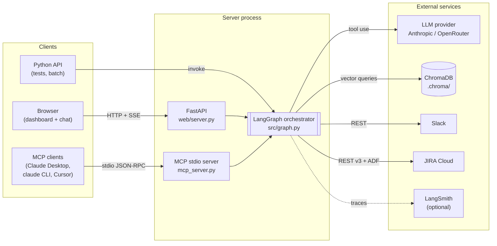
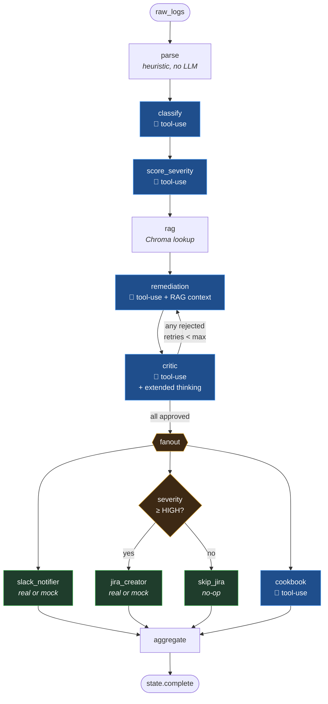
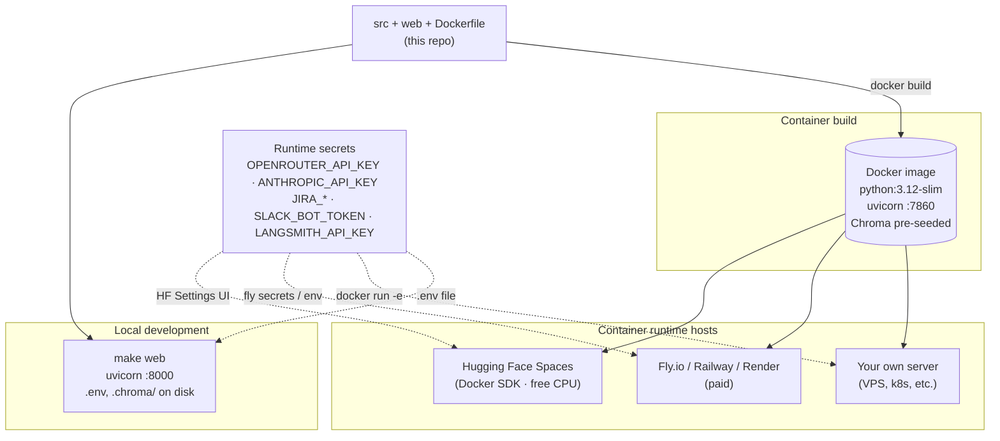

# Architecture

Deep-dive on how the pieces fit. Cross-referenced to source so you can navigate.

---

## 0. Topology at a glance

Three classes of clients hit the same agent pipeline through different transports. The pipeline itself is a single LangGraph that talks to one LLM provider, one vector store, and three external integrations.



The dashboard (`web/`), MCP server (`mcp_server.py`), and Python API (`from src.graph import get_graph`) all run the **same** [src/graph.py](../src/graph.py) under the hood. Adding a new client transport doesn't touch any agent code.

---

## 1. Shared state

Everything is anchored on a single typed Pydantic model: `IncidentState` ([src/state.py](../src/state.py)).

Every node in the graph reads the state and returns a *partial dict* of updates. LangGraph merges those updates into the canonical state.

Two kinds of fields:

- **Single-writer fields** — `incidents`, `rag_matches`, `remediations`, etc. Last-write-wins is safe because exactly one node owns each field.
- **Accumulator fields** — `trace`, `errors`. Annotated with `Annotated[..., add]` so concurrent writes from the parallel fan-out branches accumulate cleanly via list concatenation. This is the idiomatic LangGraph pattern.

Control-flow knobs on state:
- `critic_retries` / `max_critic_retries` — bounds the self-critique loop
- `strict_critic: bool` — toggles the stricter critic prompt variant

---

## 2. The graph

[src/graph.py](../src/graph.py) wires the pipeline.

### Topology



**Five LLM agents (blue)**, **two routing gates (amber)**, **three integration agents (green)**, and three deterministic nodes (parse, rag, aggregate).

### Conditional edges

Two routing functions, both pure (no state mutation):

- `route_after_critic(state)` ([graph.py:40](../src/graph.py#L40)) — if any critique is rejected and we're under the retry budget, loop back to remediation; otherwise fan out.
- `should_create_ticket(state)` ([graph.py:56](../src/graph.py#L56)) — checks whether any incident is HIGH or CRITICAL. If yes, route to `jira_creator`; otherwise to a `skip_jira` no-op node (which still emits a trace step so the UI can show the gate decision).

### Parallel fan-out

`fanout` is a no-op entrypoint with three downstream edges (`slack_notifier`, `jira_creator|skip_jira`, `cookbook`). LangGraph executes those concurrently. They all converge on `aggregate`, the final fan-in.

### Self-critique loop

The loop edge `critic → remediation` is the project's most distinctive structural feature. The remediation agent ([remediation.py](../src/agents/remediation.py)) is loop-aware:

- On retry it sees `state.critique` with rejections and `state.remediations` with the prior plan
- It only regenerates rejected incidents (approved ones are kept verbatim — token-efficient)
- It bumps `state.critic_retries` so the routing function can enforce the cap

`max_critic_retries=1` by default, so the loop fires at most once per run.

---

## 3. Agents

All five LLM agents follow the same skeleton (in this order):

1. Build the user message from the relevant slice of state
2. Call `llm.get_client().messages.create(...)` with:
   - System prompt loaded from a `.md` file in [src/prompts/](../src/prompts/)
   - System content wrapped in `[{"type":"text", "text":..., "cache_control":{"type":"ephemeral"}}]` for prompt caching
   - A single tool definition that mirrors the Pydantic shape we want back
   - `tool_choice` forced to that tool name (so structured output is guaranteed, not best-effort JSON parsing)
3. Pull the `tool_use` content block out of the response
4. Build the typed Pydantic objects and return them in the partial state dict
5. On any exception, fall back to a placeholder so the graph still completes

Per-agent specifics:

| Agent | Prompt | Tool | Notes |
|-------|--------|------|-------|
| **Classifier** | [classifier.md](../src/prompts/classifier.md) | `report_incidents` | Caps input at 150 events. Returns `event_indices` per incident; we compute `sample_events` and `event_count` from those. |
| **Severity** | [severity.md](../src/prompts/severity.md) | `score_severity` | Single batched call scores all incidents — lets the model rank relatively. Rebuilds incidents via `model_copy(update={...})`. |
| **Remediation** | [remediation.md](../src/prompts/remediation.md) | `propose_remediation` | RAG matches + (on retry) prior remediation + critic feedback embedded in the user message. Per-incident invocation; approved-on-prior-pass incidents kept verbatim. |
| **Critic** | [critic.md](../src/prompts/critic.md) or [critic_strict.md](../src/prompts/critic_strict.md) | `review_remediations` | **Extended thinking** enabled (`thinking={"type":"enabled","budget_tokens":2000}`). API constraint: this means `tool_choice` cannot force a specific tool — must be `"auto"`. Strict mode swaps in a stricter rubric biased toward rejection (used to demo the loop). |
| **Cookbook** | [cookbook.md](../src/prompts/cookbook.md) | `synthesize_cookbook` | May produce *fewer* entries than incidents — model collapses related incidents into one runbook entry. |

### Critic — extended thinking

The critic is the only agent with extended thinking enabled, because it's the safety gate where reasoning quality matters most.

API gotchas (learned the hard way):
- `temperature` must be 1 (default)
- `max_tokens` must exceed `budget_tokens`
- `tool_choice` cannot be `{"type":"tool", "name":...}` or `{"type":"any"}` — Anthropic returns 400 "Thinking may not be enabled when tool_choice forces tool use." Only `"auto"` is allowed. We rely on the system prompt's explicit "Call the `review_remediations` tool exactly once" instruction; Sonnet honors this reliably.

The thinking blocks are concatenated and attached to every `CritiqueResult` from the call, then surfaced in the dashboard under each verdict.

### Fallback safety net

Every agent's API call is wrapped in try/except. On failure:
- Emit a placeholder (e.g., classifier returns one fallback `Incident` with the parsed events; critic auto-approves; cookbook synthesizes a generic entry from the remediation steps)
- Append a string to `state.errors` so the failure surfaces in the UI's Trace tab
- Mark the trace step `status="error"`

This is what keeps the smoke test green when there's no `ANTHROPIC_API_KEY`, and what keeps the graph completing end-to-end during a transient API outage.

---

## 4. Provider routing

[src/llm.py](../src/llm.py) is a thin shim. `get_client()` returns a configured `anthropic.Anthropic` instance. If `OPENROUTER_API_KEY` is set, it points the SDK at OpenRouter's Anthropic-compatible endpoint:

```python
anthropic.Anthropic(
    api_key=os.environ["OPENROUTER_API_KEY"],
    base_url="https://openrouter.ai/api",   # NOT /api/v1 — the SDK appends /v1/messages itself
)
```

`get_model()` returns the right model id format (`claude-sonnet-4-5` for Anthropic direct, `anthropic/claude-sonnet-4.5` for OpenRouter).

**Why this works**: OpenRouter exposes an Anthropic-compatible `/v1/messages` endpoint. Same wire format as Anthropic's API, so all features that the underlying model supports — tool use, prompt caching, extended thinking — pass through unchanged. The agents themselves stay provider-agnostic.

---

## 5. RAG

### Corpus

[data/seed_incidents.jsonl](../data/seed_incidents.jsonl) — **30 hand-curated past incidents** (id, title, summary, remediation, category) covering CrashLoopBackOff, OOM, DB pool, TLS, latency, disk, auth, deploy, Kafka lag, Redis evictions, DNS, mTLS, rate-limit cascades, Postgres replication, Helm rollouts, memory leaks, GC pauses, CDN failures, autoscaler caps, etcd elections, sidecar OOMs, webhook timeouts, lock contention, OAuth races, NetworkPolicies, ECR rotation, disk pressure, Lambda cold starts, RDS storage. Indexed via `make seed`.

### Storage

ChromaDB persisted to `.chroma/` on disk ([vectorstore.py:104-117](../src/tools/vectorstore.py#L104-L117)).

### Embedder

A custom feature-hashing bag-of-words embedder ([vectorstore.py:47-99](../src/tools/vectorstore.py#L47-L99)) — **not** sentence-transformers. Trade-off documented at the top of the file:

- ✅ Zero external model download — no HuggingFace dependency, deterministic, fast, works air-gapped, friendly for graders/CI with no setup
- ❌ Less semantically rich than transformer embeddings. Acceptable here because incident text shares strong domain keywords (`OOMKilled`, `CrashLoopBackOff`, `503`, `pool exhausted`, `panic`) that BoW-hashing catches well.

To swap in real embeddings: replace `_embedder` at [vectorstore.py:101](../src/tools/vectorstore.py#L101) with `chromadb.utils.embedding_functions.SentenceTransformerEmbeddingFunction(...)` and re-seed.

### Retrieval

[rag_retriever.py](../src/agents/rag_retriever.py) is a graph node, not an agent. For each incident, query is `title + "\n" + summary`, top-3 matches with similarity scores stored in `state.rag_matches`. Each match carries `past_id` so the remediation agent can cite it (e.g. `references=["PAST-003"]`).

### Surfacing — making strong matches visible to humans

Beyond the model-internal grounding, strong matches (similarity ≥ `RAG_SURFACE_THRESHOLD`, default `0.4`) are surfaced verbatim to outputs:

- **JIRA description** — adds a `## Reference: similar past incident(s)` section with the matched id, title, and verbatim past remediation
- **Slack message** — single-line footer like `_Reference: similar to PAST-003 (sim 0.45) — see ticket for prior fix_`
- **Dashboard Incidents tab** — per-incident "Reference: prior fix that worked" block

The threshold is intentionally low because the BoW-hash embedder produces lower similarity scores (~0.3-0.5 even for near-perfect matches) than transformer embeddings would (~0.7-0.9). Helper: `select_strong_matches()` in [src/state.py](../src/state.py).

---

## 6. Streaming + dashboard

### Sequence

```mermaid
sequenceDiagram
    autonumber
    actor U as User
    participant B as Browser (app.js)
    participant S as FastAPI<br/>(web/server.py)
    participant Q as Queue&lt;run_id&gt;
    participant W as Worker thread
    participant G as LangGraph
    participant L as LLM provider

    U->>B: click "Run pipeline"
    B->>S: POST /api/run {raw_logs, strict_critic}
    S->>Q: create Queue
    S->>W: spawn thread (run pump)
    S-->>B: 200 {run_id}

    B->>S: GET /api/stream/{run_id} (SSE)
    activate S

    W->>G: graph.stream(state)
    loop per node completion
        G->>L: messages.create(...)
        L-->>G: tool_use response
        G-->>W: yield {node, delta}
        W->>Q: put SSE: node_completed
        W->>Q: put SSE: usage (if LLM agent)
        Q-->>S: drain
        S-->>B: event: node_completed
        Note over B: Mermaid node animates,<br/>tab content + cost meter update
    end

    W->>Q: put SSE: done
    W->>Q: put None  (close sentinel)
    Q-->>S: drain done
    S-->>B: event: done
    deactivate S
    Note over B: status flips to "complete"
```

### Backend

[web/server.py](../web/server.py) is a FastAPI app. Three routes drive the dashboard:

- `POST /api/run` — start a graph run, returns a `run_id`
- `POST /api/tail/{name}` — start a "tail mode" run that streams the file line-by-line first, then runs the graph
- `GET /api/stream/{run_id}` — Server-Sent Events stream of pipeline events

A per-run `Queue` shuttles events from the worker thread (running the graph) to the SSE generator. Event types:

| Event | When | Payload |
|-------|------|---------|
| `run_started` | At the top of the run | `{filename, log_bytes, mode?, strict_critic}` |
| `log_line` | Tail mode only — one event per line, paced ~100ms each | `{line}` |
| `node_completed` | After each LangGraph node finishes | `{node, delta}` — delta is a trimmed projection of state updates |
| `usage` | After each LLM call (drained from a global accumulator after every node) | `{agent, model, input_tokens, output_tokens, cache_read_tokens, cache_creation_tokens, cost_usd}` |
| `done` | Pipeline complete | `{summary}` |
| `error` | Pipeline-level exception | `{error}` |

### Frontend

[web/static/app.js](../web/static/app.js) — vanilla JS, no build step. Renders a Mermaid DAG once at load, indexes the SVG node groups by their LangGraph node name, then animates per-node state from the SSE stream:

- On `node_completed`: mark the node done (or error), pre-light its successors as "active" (pulsing blue) — but only successors whose conditions match. This mirrors the server's `route_after_critic` and `should_create_ticket` logic so unused branches don't get stuck pulsing.
- On `usage`: aggregate per-agent and update the topbar cost meter
- On `log_line`: append to the log panel
- On `done`: close the EventSource, show the run summary

Hover tooltips on each node ([app.js `NODE_INFO`](../web/static/app.js)) pull from current aggregate state — what the agent does, current state pill, live metrics (incidents produced, severities, RAG hits, runbook entries), and the agent's cost row when applicable.

Light/dark theme: CSS variables driven by `[data-theme="..."]` on `<html>`. Choice persists in localStorage; default follows `prefers-color-scheme`. Mermaid re-renders with the matching theme on toggle, preserving any active node states.

---

## 6.5 Chat assistant

The dashboard ships with an embedded chat drawer ([web/static/index.html](../web/static/index.html), [app.js](../web/static/app.js)) backed by `POST /api/chat`. The assistant sees the same run state the dashboard does — incidents, remediations, critique with thinking, RAG matches, JIRA tickets, cookbook, trace, usage — passed as context with every turn.

**Why the chat is POST-with-streaming, not SSE-via-EventSource**: `EventSource` only supports GET. Chat uses `fetch()` against `POST /api/chat` and parses the SSE-format response body manually (`parseSseFrame` in app.js). The frame format is identical to the pipeline streaming so the parser code is reusable.

**Stateless server, client owns history**: each turn's request includes the full message history (capped at last 10 to bound prompt size) plus a snapshot of `aggregate` state. There's no session storage on the server. Reload = fresh conversation.

**Cost flows through the same accumulator**: `usage.record("assistant", model, resp.usage)` after each chat turn — appears in the topbar cost meter alongside pipeline agents.

System prompt: [src/prompts/assistant.md](../src/prompts/assistant.md). It enforces "only reason from `<run_state>` — do not invent" with explicit citation guidance (use real ids like `INC-001`, `PAST-003`, `KAN-8`). If you change the snapshot shape in `snapshotStateForChat()`, update the "What you can see" section of the prompt in lockstep.

---

## 7. MCP server

[mcp_server.py](../mcp_server.py) is a self-contained FastMCP stdio server that exposes the same agent pipeline to any MCP client (Claude Desktop, `claude` CLI, Cursor, …).

Three tools:

- `analyze_logs(raw_logs, strict_critic=False)` — runs the full graph, returns shaped per-incident analysis + runbook + summary
- `analyze_log_file(path, strict_critic=False)` — convenience wrapper that reads a log file from the server's filesystem
- `search_past_incidents(query, k=3)` — RAG-only lookup, fast (no LLM round-trip)

The output is **shaped** — the raw `IncidentState` has internal fields (parsed_events, trace, full critique objects) that aren't useful to an LLM caller. `_shape_pipeline_result()` projects only the actionable fields per incident.

**Stdio discipline**: stdio MCP servers must never write to stdout (it's the protocol channel). The module routes all logging to stderr and pops `LANGSMITH_TRACING` to prevent stray prints from upstream code.

See [docs/OPERATING.md#mcp-server](OPERATING.md#mcp-server) for the Claude Desktop config snippet.

---

## 8. Cost tracking + prompt caching

### Caching

Every agent wraps its system prompt in `cache_control: {"type": "ephemeral"}`. Anthropic caches that content for ~5 minutes. The cache key includes system prompt + tools + initial messages, so each agent has its own cache entry.

**Honest gotcha**: the minimum cacheable size is **1024 tokens** for Sonnet/Opus. Of the five agent prompts, only the classifier (~1100 tokens) currently exceeds this. The others' prompts (severity, remediation, critic, cookbook) sit just below the threshold, so `cache_control` is set but no cache entry is actually created. Instrumentation is correct — the moment a prompt grows past the threshold (e.g., adding a shared SRE handbook preamble), cache hits register automatically.

### Cost accumulator

[src/usage.py](../src/usage.py) is a process-global, lock-protected list of `UsageRecord`s. Each agent calls `usage.record(agent_name, model, resp.usage)` after a successful API response. The server drains new records after every chunk and emits them as SSE `usage` events.

Why a global lock instead of `threading.local`: LangGraph's parallel fan-out dispatches nodes across worker threads, so a thread-local accumulator initialized in the pump thread wouldn't see records appended by the cookbook (which runs in a parallel branch alongside Slack/JIRA).

Pricing table at [src/usage.py:18-34](../src/usage.py#L18-L34) covers Sonnet/Opus/Haiku 4.x both with their direct ids (`claude-sonnet-4-5`) and OpenRouter aliases (`anthropic/claude-sonnet-4.5`). For exact OpenRouter billing, query their `/models` endpoint at runtime — current rates are best-effort.

---

## 8.5 Deployment



The repo is set up for two deployment shapes:

**Local development** — `make web` runs uvicorn on port 8000 with hot reload. Best for iteration.

**Container deployment** ([Dockerfile](../Dockerfile)) — `python:3.12-slim` base, runs as non-root user 1000 (HF Spaces convention), pre-seeds Chroma at build time so cold starts skip the seed cost, listens on port 7860. Suitable for any Docker host.

The repo's [README.md](../README.md) starts with HF Spaces YAML frontmatter that turns the same repo into a deployable Hugging Face Space (Docker SDK). The free CPU tier (16GB RAM) handles the deps without trouble. Sleeps after ~48h of inactivity; first request wakes the container in 30-60s.

What the Dockerfile deliberately doesn't do: bake `.env` (secrets pass at runtime), set `LANGSMITH_TRACING` (managed by [web/server.py](../web/server.py) based on key presence — see [CLAUDE.md](../CLAUDE.md#langsmith--langchain-tracing) for why).

See [docs/OPERATING.md](OPERATING.md#docker--hugging-face-spaces) for the full deploy guide.

---

## 9. Mock mode (no external creds)

Three integrations support a mock fallback so the project runs end-to-end without external service credentials:

| Integration | Triggered when… | Behavior |
|-------------|-----------------|----------|
| **Anthropic** | `ANTHROPIC_API_KEY` and `OPENROUTER_API_KEY` both unset | Each agent's try/except catches the auth error; emits a placeholder result; appends to `state.errors`. Pipeline still completes. |
| **Slack** | `SLACK_BOT_TOKEN` unset | `tools/slack.py` returns `{"ok": True, "ts": ..., "dry_run": True}`; logs the would-be payload. |
| **JIRA** | Any of `JIRA_URL` / `JIRA_EMAIL` / `JIRA_API_TOKEN` unset | `tools/jira.py` returns a mock key like `OPS-MOCK-1`; logs the would-be ticket. |

The dashboard surfaces this in the topbar pills (`live` vs `mock`) and per-result badges in the Slack/JIRA tabs.

See [docs/OPERATING.md](OPERATING.md) for the env reference and how to flip each integration to live.

---

## 10. Customization

### Add an agent

1. Create the system prompt at `src/prompts/<name>.md`
2. Create `src/agents/<name>.py` following the existing skeleton (load prompt, build tool, call API, parse tool_use, return partial state)
3. If the agent owns a new state field, add it to `IncidentState` in [src/state.py](../src/state.py)
4. Wire the node into the graph in [src/graph.py](../src/graph.py) (`g.add_node`, `g.add_edge`)
5. Add the node to the topology and `NODE_INFO` in [web/static/app.js](../web/static/app.js) so the UI animates and tooltips it
6. Add the node to the Mermaid `GRAPH_DEF` in app.js

### Swap the embedder

Replace `_embedder` at [vectorstore.py:101](../src/tools/vectorstore.py#L101) with any `chromadb` embedding function. Delete `.chroma/` and re-run `make seed` to re-index.

### Change provider / model

Set `ANTHROPIC_MODEL` (Anthropic direct) or `OPENROUTER_MODEL` (OpenRouter). For OpenRouter, use the `provider/model` form like `anthropic/claude-opus-4.7`. Pricing table at [src/usage.py:18](../src/usage.py#L18) — add a new row for any model not already covered.

### Tighten or relax the critic

Edit [src/prompts/critic.md](../src/prompts/critic.md) (default) or [src/prompts/critic_strict.md](../src/prompts/critic_strict.md) (strict mode). The "hard reject if any of these conditions apply" pattern is what makes the rubric model-friendly — keep that shape if you want predictable behavior.

### Tune RAG match surfacing

`RAG_SURFACE_THRESHOLD` env var (default `0.4`) controls when matches surface to JIRA / Slack / dashboard. Lower → more matches surface, higher → fewer. The threshold is calibrated to the BoW-hash embedder; recalibrate if you swap embedders.
